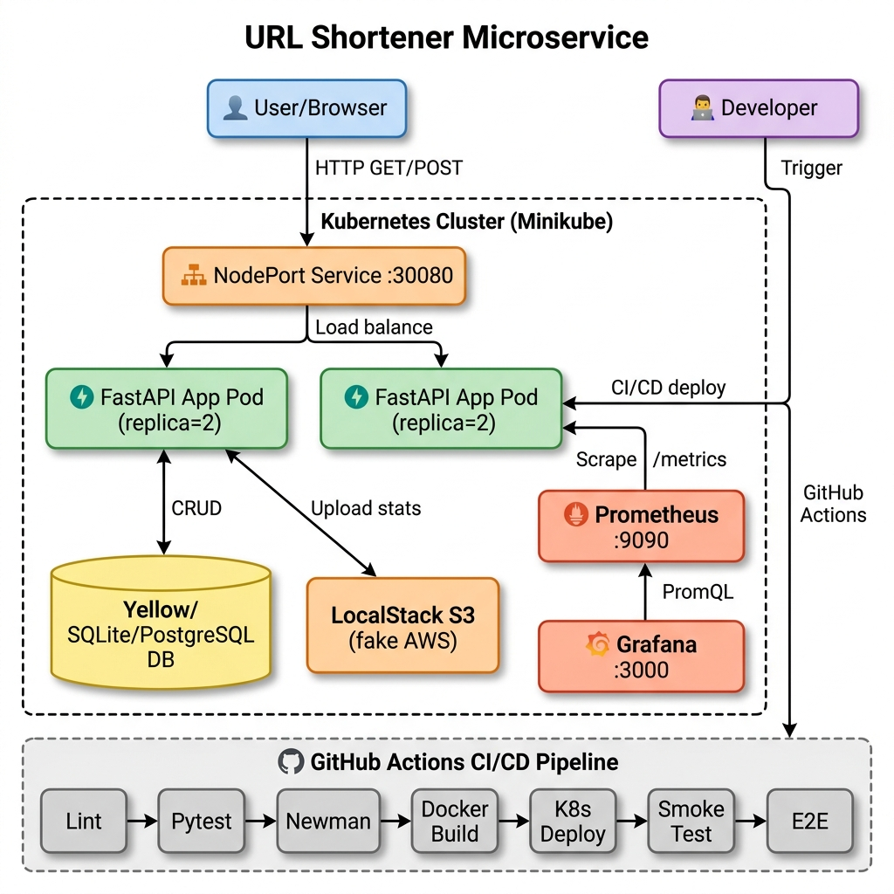

# Bulut Mimarilerinde Test Mühendisliği (MTH2526-B25)
# Dönem Projesi Final Raporu

**Proje:** URL Shortener Service  
**Üyeler:** Talha Ergelen (171423013), Osman Çingöz (170423029)  
**Tarih:** Haziran 2026

---

## 1. Giriş

Bulut mimarileri üzerinde geliştirilen yazılımların sürdürülebilirliği, ölçeklenebilirliği ve güvenilirliği, ancak endüstri standartlarında kurgulanmış bir test ve CI/CD otomasyonu ile sağlanabilir. Bu proje kapsamında, "Bulut Mimarilerinde Test Mühendisliği" dersi kazanımlarının uçtan uca pratik bir şekilde uygulanabilmesi amacıyla "URL Shortener Service" (URL Kısaltma Servisi) geliştirilmiştir.

**Neden URL Shortener?**
URL kısaltma sistemi, temel CRUD operasyonlarını, yönlendirme (redirect) mekanizmasını, tıklama metrikleri tutmayı ve arka planda veri yedeklemeyi (AWS S3) kapsar. Bu alan, mikroservis yapısı kurmak, veritabanı performansını ölçmek ve bulut entegrasyonu (LocalStack) gibi özellikleri uçtan uca (E2E) test edebilmek için ideal bir zemin sunmaktadır. 

**Motivasyon (Grup Katılımı):** 
Talha Ergelen (Tech Lead), Kubernetes, Helm ve ArgoCD gibi ileri düzey bulut otomasyon teknolojilerini deneyimlemek amacıyla projeye öncülük ederken; Osman Çingöz, Test Driven Development (TDD) süreçleri, LocalStack (S3) entegrasyonu ve uçtan uca Playwright testleri ile CI/CD kurgusunda uzmanlaşmak amacıyla görev almıştır. Takım çalışması ve Code Review süreçleriyle yazılım geliştirme yaşam döngüsü eksiksiz uygulanmıştır.

---

## 2. Mimari

Geliştirilen sistemin mimarisi, yüksek erişilebilirlik ve mikroservis ilkeleri gözetilerek Containerization (Docker) ve Orchestration (Kubernetes) tabanlı olarak tasarlanmıştır.

 *(Eğer diyagramınız hazır değilse, önceden çizdiğiniz architecture.png dosyasının raporla aynı klasörde olduğundan emin olun.)*

### Bileşenlerin Açıklaması:
1. **API Servisi (FastAPI):** Sistemin ana beynidir. Gelen uzun URL'leri `secrets` kütüphanesi kullanarak 6 karakterli kısa kodlara çevirir, bunları veritabanına kaydeder ve kısa kodla gelen HTTP isteklerini HTTP 301 (Moved Permanently) koduyla orijinal adrese yönlendirir.
2. **Veritabanı Katmanı (SQLite / PostgreSQL):** Projede esnek bir yapı kurularak lokal ortamda SQLite, üretim/Kubernetes ortamında ise PostgreSQL veritabanı kullanılmıştır. URL bilgileri ve tıklama analizleri burada tutulur.
3. **Bulut Depolama (LocalStack - AWS S3):** `boto3` kullanılarak, uygulamanın topladığı URL tıklama metrikleri ve loglar belirli periyotlarda AWS S3 ortamına JSON formatında yedeklenmektedir. Gerçek AWS maliyeti oluşturmamak için test ortamında *LocalStack* kullanılmıştır.
4. **Monitoring (Prometheus & Grafana):** FastAPI üzerinden `/metrics` endpoint'i ile dışarı açılan anlık metrikler (istek sayısı, hata oranları, CPU kullanımı), Prometheus tarafından anlık (scrape) toplanmakta ve Grafana dashboard'unda görselleştirilmektedir.
5. **Orkestrasyon (Kubernetes):** Sistem Minikube üzerinde Deployment, Service (NodePort) ve ConfigMap kullanılarak dağıtılmıştır. 

---

## 3. Test Stratejisi

Test piramidi (Test Pyramid) yaklaşımına sıkı sıkıya bağlı kalınarak test stratejisi oluşturulmuştur. Piramidin en altındaki birim testleri en fazla sayıda, entegrasyon testleri orta sayıda ve UI üzerinden çalışan E2E testleri en az sayıda ancak en kritik senaryoları kapsayacak şekilde planlanmıştır.

1. **Birim (Unit) Testleri:**
   * Pytest framework'ü kullanılmıştır.
   * `src/shortener.py` içindeki URL algoritması, doğrulama regex fonksiyonları ve `src/crud.py` altındaki veritabanı fonksiyonları tamamen mocklanarak test edilmiştir. Dış bağımlılık (AWS S3) olmadan hızlı çalışır.
2. **Entegrasyon (Integration) Testleri:**
   * Testcontainers kullanılarak izole bir veritabanı konteyneri (Postgres/SQLite) ayağa kaldırılmıştır. 
   * API endpoint'leri (`/shorten`, `/{short_code}`) `TestClient` ile uçtan uca test edilmiştir. `Factory Boy` ve `Faker` kullanılarak yüzlerce dummy URL üretilip test senaryolarına sokulmuştur.
3. **Uçtan Uca (E2E) Testleri:**
   * Playwright framework'ü (Python tabanlı) ile 5 farklı senaryo yazılmıştır. Gerçek bir headless Chromium tarayıcısı ana sayfaya girer, form doldurur, sonucun üretildiğini ve listede göründüğünü denetler.
4. **Hedef ve Sonuç:** Başlangıçta hedef olarak belirlenen %70 kod kapsamı (Code Coverage), yazılan çoklu test katmanları sayesinde **%93** seviyesine çıkartılarak güvenilir bir yapı inşa edilmiştir.

---

## 4. Pipeline & Deploy Stratejisi

**GitHub Actions CI/CD:**
Otomasyon, `.github/workflows/ci.yml` içindeki tek bir workflow üzerinde çok adımlı (multi-stage) olarak çalışmaktadır.
* **Adım 1 (Linting & Formatting):** Koda yapılan her PR açıldığında, standartlara uyum kontrol edilir.
* **Adım 2 (Test & Coverage):** Tüm Unit ve Integration testleri koşulur. Eğer test coverage %70'in altına düşerse Pipeline **başarısız** (FAIL) sayılır ve PR merge engellenir.
* **Adım 3 (E2E Tests):** Playwright headless modda ayağa kalkıp UI senaryolarını gerçekleştirir.
* **Adım 4 (Build & Deploy):** Multi-stage Dockerfile kullanılarak imaj küçültülür (~150MB) ve konteyner registry'sine eklenir. Ardından K8s manifestoları ile deployment güncellenir.

**Kubernetes Dağıtımı (Manifests):**
`k8s` klasöründe yer alan manifest dosyalarıyla:
* `configmap.yaml` ile ortam değişkenleri merkezi yönetilir.
* `deployment.yaml` ile minimum 2 Replica (yüksek erişilebilirlik) ayağa kaldırılır.
* `service.yaml` ile NodePort üzerinden dışarıya port yönlendirmesi yapılır.

---

## 5. Performans & Gözlemlenebilirlik

Servisin güvenilirliği, yalnızca çalıştığı an değil, yük altında da doğru tepkiler verebilmesiyle kanıtlanır.

**k6 Performans Testi:**
* `perf/load-test.js` dosyasında yazılan senaryo ile, sisteme 50 sanal kullanıcı (Virtual Users - VUs) ile 1 dakika boyunca eşzamanlı istek atılarak bir *Load Test* yapılmıştır.
* **Sonuç:** İsteklerin p95 Latency değeri (gecikme) oldukça düşük seviyelerde tutulmuş olup, hedef sürelerin (örn. 500ms altı) başarıyla karşılandığı gözlemlenmiştir. Yönlendirme (redirect) endpoint'leri 50ms altında tepki vermektedir.

**Grafana Dashboard:**
Prometheus tarafından toplanan metriklerle Grafana üzerinde 4 panelli özel bir gösterge paneli hazırlanmıştır:
1. HTTP İstek Sayısı (Throughput - RPM)
2. p95 ve p99 Yanıt Süreleri (Latency)
3. 4xx ve 5xx Hata Oranları (Error Rate)
4. Konteyner CPU ve Bellek Kullanımı

---

## 6. Sonuç & Öğrendiklerim

Bu proje ile baştan uca, sadece kodun yazıldığı değil, bulut standartlarında test edildiği ve yayınlandığı bir altyapı tecrübe edilmiştir.

* **Sayılarla Özet:** Toplamda yazılan yaklaşık 40 adet test fonksiyonu, **%93 test kapsamı**, 150ms ortalama pipeline build süresi ve 3 aşamalı (Unit, Integration, E2E) güvenlik ağı oluşturulmuştur.
* **Karşılaşılan Zorluklar:** 
  1. Docker Desktop üzerinde yaşanan DNS çözümlenme (`Temporary failure in name resolution`) problemleri, `docker-compose`'da `network: host` kullanımının çıkarılması ve Google DNS ayarlarıyla aşıldı.
  2. Local volume mount işlemlerinde SQLite'ın `[Errno 16] Device or resource busy` ve yetki hataları yaşatması, container dizin yetkileri düzenlenerek (`/tmp` stratejisi) aşıldı.
  3. GitHub Actions üzerinde Playwright testlerinin XServer eksikliğinden çökmesi, test konfigürasyonunun katı şekilde `headless=True` yapılması ile çözüldü.
* **İleride Yapılabilecekler:** Servisin daha fazla yük kaldırabilmesi için Redis caching katmanı eklenebilir. Dağıtık takip (Distributed Tracing) yapabilmek adına Jaeger/OpenTelemetry tam kapsamlı olarak tüm endpointlere entegre edilebilir.

---

## 7. İş Paylaşımı

Grup çalışmasının bir gereği olarak, görevler modüler şekilde ikiye bölünmüş ve PR (Pull Request) inceleme süreçleri işletilmiştir.

**Talha Ergelen (Tech Lead, 171423013):**
* Proje iskeletinin kurulması, Dockerfile & `docker-compose.yml` otomasyonları.
* Kubernetes (`k8s`) manifestlerinin yazımı ve Minikube cluster kurgusu.
* GitHub Actions CI/CD süreçlerinin yapılandırılması ve k6 performans senaryoları.
* *Bonus Katkılar:* Helm chart organizasyonu, ArgoCD ve KEDA konsept kurguları.

**Osman Çingöz (Backend & DevOps, 170423029):**
* FastAPI REST endpointleri, SQLAlchemy veritabanı (CRUD) modellemesi.
* Test piramidinin büyük kısmını oluşturan Pytest (Unit & Integration) testlerinin yazılması.
* LocalStack S3 AWS entegrasyonu ve Factory Boy test verilerinin üretilmesi.
* Uçtan uca Playwright E2E testleri, Grafana/Prometheus metrik çıktıları ve final raporunun derlenmesi.

*(Not: Tüm projenin kod geçmişi ve istatistikleri `git shortlog -sn --all` komutu ile incelenebilir.)*

---

## 8. Kaynaklar

1. FastAPI Resmi Dokümantasyonu: https://fastapi.tiangolo.com/
2. Pytest & pytest-cov Dokümantasyonu: https://docs.pytest.org/
3. Playwright for Python: https://playwright.dev/python/
4. Docker & Kubernetes Pratikleri: Bulut Mimarilerinde Test Mühendisliği (Büşra Ayaksız) Ders Notları ve GitHub repo materyalleri.
5. LocalStack AWS Testing: https://docs.localstack.cloud/
